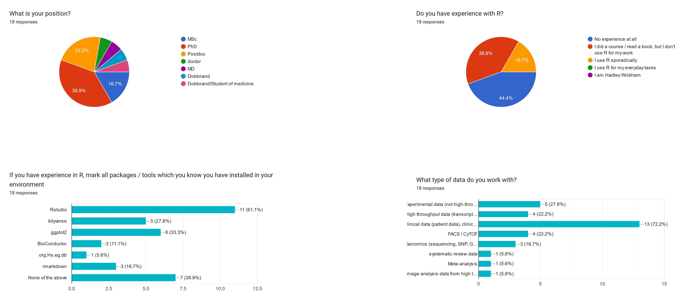
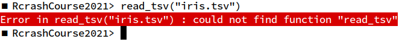
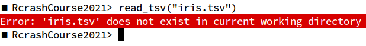

```{r,echo=FALSE}
## Set default options for the knitr RMD processing
knitr::opts_chunk$set(echo=FALSE,warning=FALSE,message=FALSE,fig.width=5,fig.height=5,cache=FALSE,autodep=TRUE, results="hide")
```

```{r libraries,cache=FALSE}
```

# R crash course

## Important links 

 * E-mail: `<cubi-teaching@charite.de>` 
 * Github: `https://github.com/bihealth/RcrashCourse2021`
 * Teams


## The Team


{ height=400px }

## Getting to know you

{ height=400px }

## Aims

 * R for data science (Hadley Wickham)
 
{ width=600px }

 * Give you a jump start to 
    * exchange data between R and spreadsheet programs such as Excel
    * manipulate and display the data
    * run simple statistical analysis (t-test, non-parametric tests, basic ANOVA, basic linear regression) 
    * create reports from your analysis in a number of formats

 * Give you good habits
 * Proceed along a helix


## Course files

Course repository: https://github.com/bihealth/Rcrashcourse2021

Course pages (for viewing lectures): https://bihealth.github.io/RcrashCourse2021/

To view the lectures, click on the link or download the HTML file and open it in a browser.

## Aims for today

* Introducing RStudio as environment for developing your own programs
* Concepts on good coding practice
* Language basics of R (variables, operators, functions ...)

# How to start

## Creating a new project

 * In Rstudio, go to File -> New Project 
 * When the dialog window appears, select New Directory -> New Project

A project is not a file – but a directory which contains all relevant files
(scripts, documentation, Excel files with the source data, exported
documents...). You can put anything in this directory.

It is a very good idea to save all data and meta-data related to your
project in this directory.

## Example R session

First example

```{r eval=FALSE,echo=TRUE}
iris <- read_tsv("iris.tsv")
```


## Why doesn't it work?





 * Don't panic!

 * Do not ignore error messages. Very often, they tell you exactly what the
   problem is.


## The rdesktop workplace

 * Windows
 * Menus
 * Workspace

## Workspaces

 Workspace is basically a folder which contains a few special files in
 which R stores project-specific data.

  * `Rhistory` (hidden file) – a text file containing all commands that you
    have issued
  * `Rdata` (hidden file) – a binary file containing your workspace (all
    variables created)
  * `<filename>.Rproj` – Rstudio R project file containing some
    rstudio-specific settings (text file)
  * Anything else should be save by you

## Examples of R applications

 * Why programming?
 * Why R?
 * Alternatives: Python, matlab, other statistical languages

## A few notes on R

 * R vs matlab
 * "There is more than one way of doing it" (but one way will usually be
   optimal)
 * Tidyverse vs standard R (demo)
 * ggplot vs basic plots (demo)

# R language basics

## R language basics (demo)


```{r echo=TRUE}
## Anything starting with a '#' is a comment
## Assignment and creating variables 

a <- 2
name <- "Manuela"

## vectors and multiple assignment 

a <- c(1, 7, 9)

## operators 

a <- 3 + 5 
b <- a * 7

## functions 

sum(c(1, 2, 3))
i <- length(a)
```

Try it out!

## Exercises 1.1

 * create variables: a string, a number, a factor
   * how to create the variables?
   * how to view the variables?
 * create a factor variable 
   * use the function `factor()`
 
## Exercises 1.2
  
  * what does `1:5` do?
  * what happens when you add a number to a vector? (i.e. `c(3, 1, 4) + 5`)
  * what happens when you multiply a vector with a number?
  * what happens when you add two vectors?

## Exercises 1.3

  Try the following code:

```{r eval=FALSE,echo=TRUE}
vec1 <- 1:10
vec2 <- 20:30

vec1 + vec2
```

This produces a warning message. Should you be worried? What happened?

What does the `length()` function do?


# Good coding practices

## Remember: language is communication

 * Your code will be seen by others
 * And this is a good thing!
 * Documentation *is* important
 * Reproducibility matters


## Literate programming


## Literate programming

I believe that the time is ripe for significantly better documentation
of programs, and that we can best achieve this by considering
programs to be works of literature. Hence, my title: “Literate
Programming.”

Let us change our traditional attitude to the construction of
programs: Instead of imagining that our main task is to instruct a
computer what to do, let us concentrate rather on explaining to
human beings what we want a computer to do.

(Donald E. Knuth)

## Literate programming

The practitioner of literate programming can be regarded as an
essayist, whose main concern is with exposition and excellence of
style. Such an author, with thesaurus in hand, chooses the names of
variables carefully and explains what each variable means. He or she
strives for a program that is comprehensible because its concepts
have been introduced in an order that is best for human
understanding, using a mixture of formal and informal methods that
reinforce each other.

(Donald E. Knuth)

## Documenting your code

 * Better a lousy documentation than none at all
 * Use spaces, empty lines, comments to structure your code
 * COMMENT, COMMENT, COMMENT
 * Document in plain text files and source code files

## Writing code

Keep your code clean:

 * be consistent!
 * use meaningful variable and function names
 * don't use shorthands
 * refactorize
 * create distinct code chunks
 * split the code into meaningful scripts
 * use a formatting style and stick to it

E.g.
http://web.stanford.edu/class/cs109l/unrestricted/resources/google-style.html

## Simplify!

 * make your code as simple as possible
 * make your functions versatile and simple
 * use simple data types if possible
 * don't overdo it!

## You never know

 * what your code evolves into
 * when you will need to publish it
 * when someone will want to see it

…so prepare in advance!

## Summary Day 1

 * Everything in R is a function. It takes a certain number of parameters
   and returns exactly one value.
 * Some special functions are *operators*.
 * Values can be assigned to variables (e.g. `a <- 2`).
 * There are different types of values, including vectors. There are
   numeric, character, logical and factor vectors.
 * Factors are important, but dangerous. Never create a factor from integer
   numbers!
 * Use `read_*` family of functions (e.g. `read_csv`, `read_tsv` etc.) for
   reading files.
 
 * Keep track of workspaces / projects. Use one directory for one project
