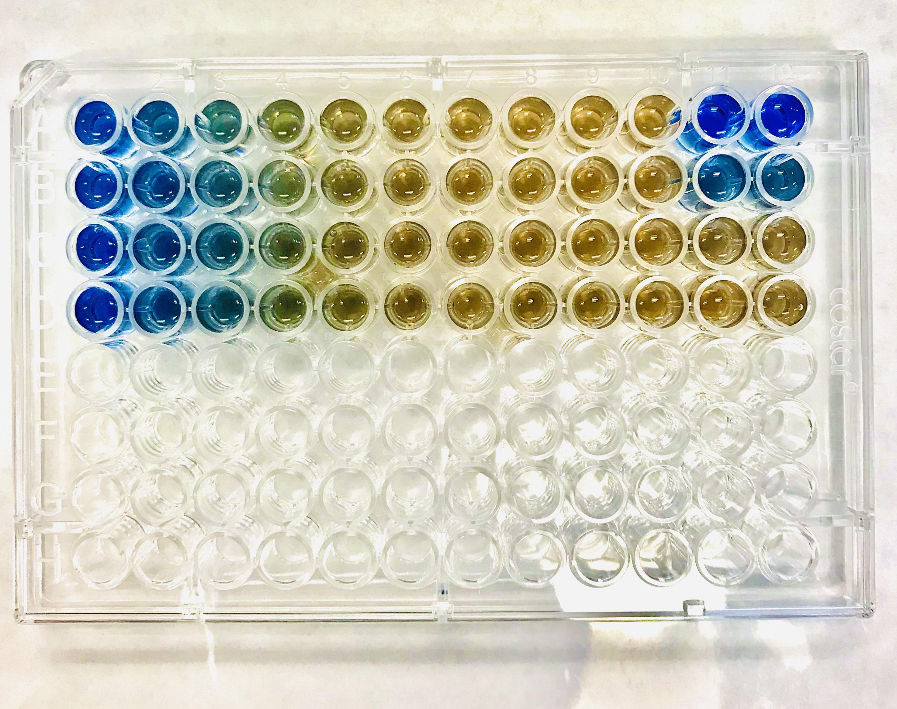
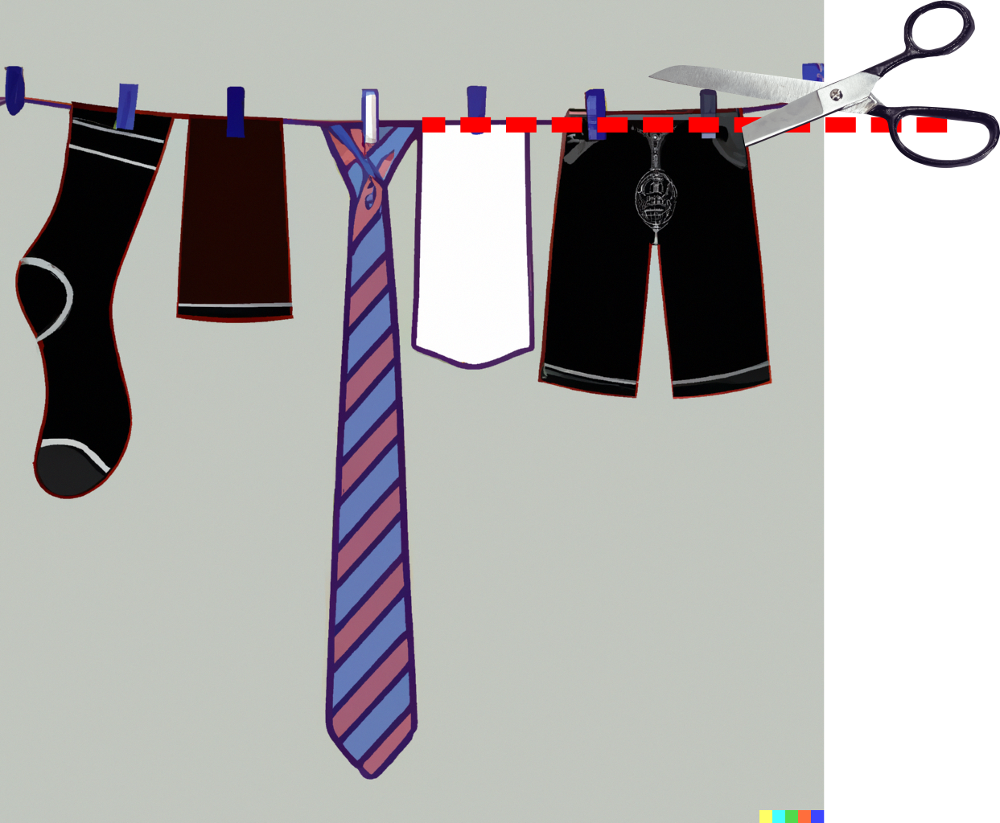
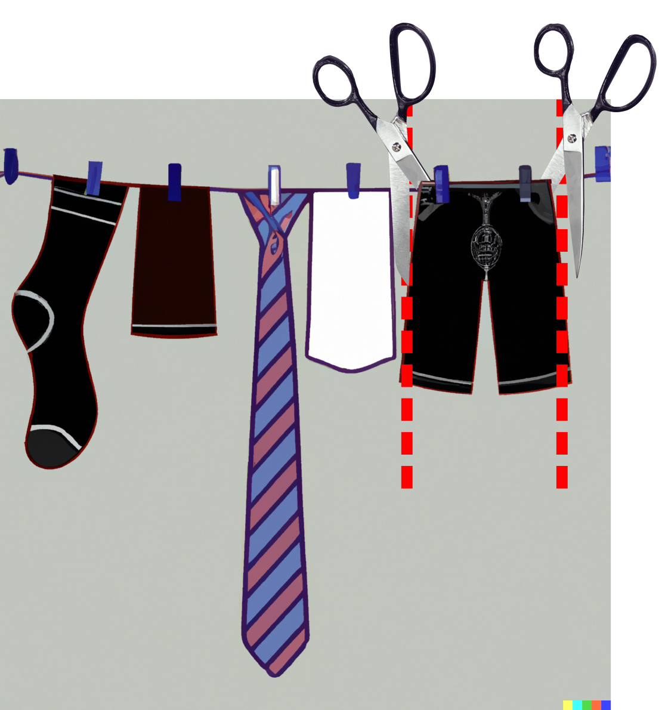

```{r,echo=FALSE}
## Set default options for the knitr RMD processing
knitr::opts_chunk$set(echo=TRUE,eval=FALSE,warning=FALSE,message=FALSE,fig.width=5,fig.height=5,cache=TRUE,autodep=TRUE, results="hide")
```

## Aims for today

* Complex data structures (matrices, lists and data frames)
* Functions in R
* Reading data from files

{ width=600px }

## Repetitorium of Day 1

Questions, anybody?

## One more thing about vectors: named indices

Elements of a vector can be accessed not only using numbers (indices) or
logical vectors. You can assign names to vectors:


```{r eval=F,echo=T}
person <- c("January", "Weiner", 134)
names(person) <- c("FirstName", "LastName", "Age")
person["FirstName"]
person["Age"]
```

## And yet another thing about vectors

Vectors *always* have only one type of data. If you mix strings and numbers,
R will convert all elements to strings.

```{r eval=FALSE,echo=TRUE,error=TRUE}
person <- c(10, 20, "30")
person * 10
```

## Functions in R: a brief reminder

```{r eval=FALSE,echo=TRUE}
samples   <- c(1, 10, 23, 42, 13)
samples_n <- length(samples)
```

 * Both `c` and `length` are functions. They take some arguments (often many
of them) and return a single object: a vector, a matrix or something else.

 * You can always assign the result of the function to a variable.

 * Sometimes functions return `NULL`, which is R for "nothing", but which is
still something you can use or assign (yet another special value! we will
meet it again later).

## Logical vectors

In R, there are two special values: `TRUE` and `FALSE`. They can be used to
create logical vectors.

```{r eval=FALSE, echo=TRUE}
sel     <- c(TRUE, TRUE, TRUE, TRUE, FALSE)
sel
!sel
```

Comparison operators (`>`, `<`, `<=`, `>=`, `==`, `!=`) produce logical
vectors:

```{r eval=FALSE, echo=TRUE}
samples <- c(1, 1, 2, 5, 7)
samples > 2
which(samples == 7)
which(samples != 1)
```


## Logical vectors

Logical vectors can be used to access elements:

```{r eval=FALSE,echo=TRUE}
persons <- c("Aphrodite", "Bacchus", "Circe", "Demeter", "Eurypides")
sel     <- c(TRUE, TRUE, TRUE, TRUE, FALSE)
persons[sel]

# we can abbreviate the TRUE and FALSE to T and F (but try to avoid it!)
greek <- persons[ c(T, F, T, T, T) ]
```

The reason to avoid using the `T` and `F` is that they can be overwritten
by the user, and then you will have a hard time debugging your code.


```{r eval=FALSE,echo=TRUE}
T <- FALSE
persons[ c(T, F, T, T, T) ]
```


* Logical subscripts video: `https://youtu.be/xmeZofFlp78` (8.4 minutes)


## Exercise 2.1: more on vectors and functions, reminder on NA


Create a vector as follows:

```{r echo=TRUE,eval=FALSE}
samples <- c(1, 10, NA, 15)
```

`NA` stands for `not available` (e.g., missing data)

 * try adding a number to that vector
 * what does `length(samples)` return?
 * what does `mean(samples)` return? Why is that?
 * use the **named parameter** `na.rm=TRUE` for the `mean()` function. Look
   up help (`?mean`) to see how it can be used. What happens now?
 * what does the `is.na()` function return when applied to `samples`?
 * how do you find `NA` values? Try `is.na` and `which`
 * How do you select only these samples which are not `NA`?
 * Back to the lilies - how would you change all values which are greater than 1 to 1?
 
## Extra (if you are bored): Creating a function

The reason we are showing how to create a function is to show you that it
is simple, and also because it will help you understand what functions are.

```{r eval=FALSE,echo=TRUE}
#' Function name
#' Function description
some_name <- function(param1, param2=2) {

## code comment
# <your code goes in here>

}
```

 * If you have to write something more than twice, you might want to turn it into
   a function!
 * R is a *functional* language:
    * almost everything is a function
    * functions usually take something and return a value; they are **not**
      supposed to use or modify anything that they have not been passed to
      explicitely (sometimes hard to avoid)

## The `rep` and `paste`/`paste0` functions

`rep` is used to replicate vectors. It is a very useful shorthand when you
need to generate e.g. experimental conditions.

```{r eval=FALSE,echo=TRUE}
rep(c("A", "B"), 5)
rep(c("A", "B"), each=5)
```

## The `rep` and `paste`/`paste0` functions

`paste` and `paste0` are used to concatenate strings. `paste` adds a space
between the strings, `paste0` does not.

```{r eval=FALSE,echo=TRUE}
paste("A", "B", "C")
paste0("A", "B", "C")

a <- c("A", "B", "C")
b <- c("1", "2", "3")
paste0(a, b)
```

Together, these functions are really useful to generate, for example,
labels, experimental conditions, names of files etc.

## Exercise 2.1b

Exercise: using rep and paste, create a vector like this: `A1, A2, A3, B1, B2, B3, C1, C2, C3`

# Complex data structures

## Main data representations in R

 * vectors (string, number, integer, logic, factor)
 * matrices and arrays
 * lists
 * data frames

## Matrices

{ height=500px }

## Matrices

Much like vectors, matrices can only hold one data type (e.g. only numeric
or only character or only logical etc.).

```{r}
m <- matrix(1:18, ncol=3, nrow=6)
# compare with
m <- matrix(1:18, ncol=3, nrow=6, byrow=TRUE)
dim(m)
ncol(m)
nrow(m)
```

## Accessing columns, rows and element

`matrix[row, column]`

So, for example:

```{r}
m[1, ] # vector which is the first row
m[, 2] # vector which is the first column
m[3, 1] # first element of the third row
```

Note: it is also possible to have arrays with more than 2 dimensions (but
you will probably not need them).

## Row and column names

We can name rows and columns of a matrix and use the names to access the
rows and columns:

```{r}
colnames(m) <- letters[1:ncol(m)]
rownames(m) <- LETTERS[1:nrow(m)]

m["A", "b"]  # one "cell"
m["B", ]     # one row
m[   , "b"]  # one column
```

`letters` and `LETTERS` are built-in vectors with the (English) alphabet.
Useful for quick labeling stuff.

## Remember

 * If you select a single column or a single row, you will get a vector
 * If you select more than one row or column, you will get a (smaller) matrix
 * If you select more rows or columns than are present, you will get a
   "subscript out of bonds" error
 * **REMEMBER:** Vectors and matrices **always** have only one data type
   (string, integer etc.)

## Exercise 2.2: Matrices - accessing and changing elements

Assume you have a 48 well-plate for a drug sensitivity analysis with viability scores.

- Create a 6x8 matrix "drugSensitivity" with random numbers between 0 and 1. Use `matrix` and `runif`. These reflect your viability scores.

Before starting you experiment, you decided to leave out the border wells to avoid edge effects:

- Change the values of the border elements to NA.

The rows are treated with inhibitor 1 with increasing concentrations (control, low, medium, high). Columns 2 to 4 are treated with inhibitor 2 with increasing concentrations (control, low, high) and column 5 to 7 are treated with inhibitor 3 (same concentrations as inhibitor 2).

- Use row and column names to reflect treatments.
- What are potential problems of this approach?
- Select all wells with inhibitor 3.
- Which wells can be used as negative control?
- Select only wells with a combination of inhibitor 1 and inhibitor 2.

## Lists {.columns-2}

{ height=400px }

 * Lists hold all types of information
 * Lists are really, really cool
 * Lists have elements. An element of a list can have *any* type, including
   another list.
 * You create lists using `list()` function


```{r echo=T,eval=F}
person <- list(name="Weiner", 
               Age=NA, 
               given="January")
```


## Accessing lists {.columns-2}

{ height=300px }

To access an element of a list, you need to use double brackets `[[`


```{r eval=FALSE,echo=T}
person[["name"]]
```

There is a shortcut:

```{r eval=FALSE,echo=T}
person$name
```

## Creating and removing elements


You can add elements to a list using the `$` operator:

```{r eval=FALSE,echo=T}
person$city <- c("Berlin", "Hoppegarten")
```

You can remove elements by assigning the NULL value to them:

```{r eval=FALSE,echo=T}
person$city <- NULL
```

## Accessing lists {.columns-2}

{ height=300px }

If you use single brackets `[`, you will get a piece of the "clothesline",
that is, you will produce a smaller list.


```{r eval=FALSE,echo=T}
person["name"]
class(person)
```

## Lists

 Caveats:

 * You access elements of a list using `[[`, not `[`
 * Lists may have names (set with `names()`), but don't have to

## Data frames

Data frames are a bit like matrices, but every column can store different
type of data. In this, they are more like lists (which they in fact are).

```{r}
names <- c("January", "Manuela", "Bill")
lastn <- c("Weiner", "Benary", "Gates")
age   <- c(1001, NA, 65)

d <- data.frame(names=names, last_names=lastn, age=age)
class(d)
class(d[,1])
class(d[,3])
```

## Accessing elements in data frames

You can access the data frame elements much like the elements of a matrix.

However, since data frames are lists, the list operator (`$`) also works:

```{r}
d$names # same as d[,1] or d[, "names"]
d$lastn
d$lastn[1]
```

However, note that when you select a row, you will get a data frame, not a
vector. This is because each of the column can be of different type, and
vectors can hold only one type of data.

## Creating new columns and removing columns

You can add new columns to a data frame using the `$` operator:

```{r}
d$city <- c("Hoppegarten", "Berlin", "Seattle")
```

You can remove columns by assigning the NULL value to them:

```{r}
d$city <- NULL
```

## Matrices vs data frames

 Caveats:

  * data frames sometimes turn strings to factors (more on that later), which may have really
    disastrous consequences, use `stringsAsFactors=FALSE`
  * small typos can turn a numeric vector into a string
  * factors are dangerous to work with, use them cautiously

  Gory details: matrices are a basic data type. Data frames are a list.

## Data frames vs tibble

 Caveats:

 * tibbles are the data frames from tidyverse
 * Whatever you can do to a data frame, you can do to a tibble as well
 * `read_*` functions return a tibble
 * tibble do not have row names
 * If you select a single row in a data frame, you get a smaller data
   frame. If you select a single column, you get a vector.
 * In tibble, you always get a smaller tibble.
 
 * `https://youtu.be/eWu7kvNBpyc` (9.2 minutes)


## Exercise 2.3

 * Create a 5x3 matrix with random numbers. Use `matrix` and `rnorm`.
 * Turn the matrix into a data frame. Use `as.data.frame` for that.
 * Add column and row names.
 * Add a column. Each value in the column should be "A" (a string). Use the
   `rep` function for that.
 * Add a column with five numbers from 0 to 1. Use the `seq` function for that.


## Summarizing all those brackets 

- `[ ]` ... accessing the element of a vector / matrix / list / data frame -> extraction operators
- `[[ ]]` ... accessing the element/items of a list
- `$` ... accessing elements by name

- `( )` ... used when calling a function to provide arguments
- `{}` ... indicating a block, eg when defining a function
