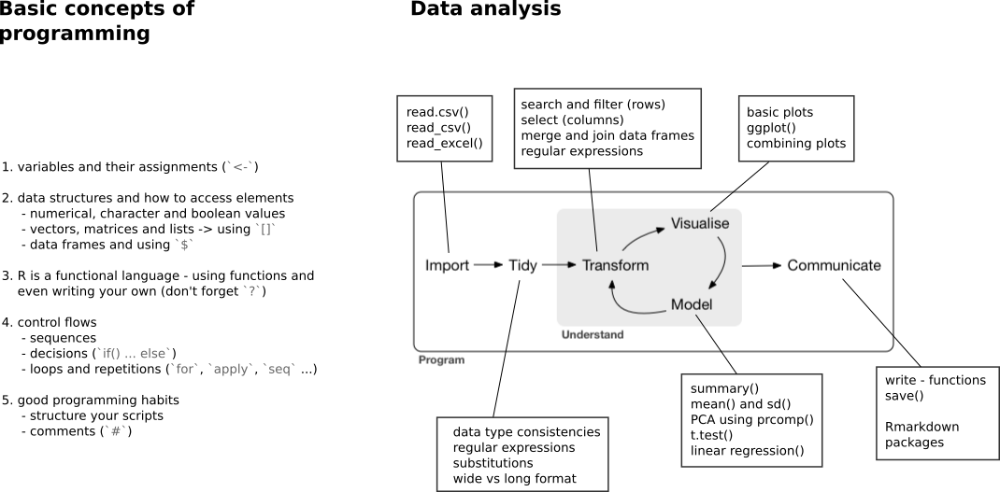

```{r,echo=FALSE,warning=FALSE,message=FALSE}
## Set default options for the knitr RMD processing
knitr::opts_chunk$set(echo=TRUE,eval=FALSE,warning=FALSE,message=FALSE,fig.width=5,fig.height=5,cache=TRUE,autodep=TRUE, results="hide")
knitr::opts_knit$set(root.dir = "../")
```

# Recap for yesterday

# Aims for today

* Searching and subsetting (regular expressions continued)
* Combining multiple data sets
* Freestyle - working on your data and questions

# Searching and subsetting

## Searching through data frames

With `%in%`, it is easy to select keywords matching a set.

```{r}
# first read in data again
res <- read.csv("Datasets/transcriptomics_results.csv")

# search for interferon
interferon <- c("TAP1","IFIH1","IRF7","PARP9","STAT1","PLSCR1",
                "IFITM1","HERC5","DDX60","USP18","RSAD2","IFIT1")
sel <- res$Gene %in% interferon
res[ sel, ] ## or: filter(res, Gene %in% interferon)
```

## `match()`

We can also use match, which for each element of one vector returns the
position of that element in the second vector:

```{r}
matches <- match(interferon, res$Gene)
res[matches, ]
```

Note however that `match()` looks for the *first* occurence of a match,
whereas `%in%` will return all matches.


## Searching for patterns

What if we don't know the exact name, or if we want to match a more general
pattern? 

For this, we can use `grepl()` (which returns a logical vector) or `grep()`
(which is the same as `which(grepl())`).


```{r}
int <- grep("Interferon", res$Description)
length(int) # no matches

int <- grep("Interferon", res$Description, ignore.case=TRUE)
head(int)
head(res[int, ])
```

## More regular expressions

```{r}
## search for GBP1, GBP2, GBP3, 
## but not GBP12 or pseudo-GBP1
sel <- grep("^GBP[123]$", res$Gene)
res[ sel, ]

## search for either cytokine or chemokine
sel <- grep("(cytokine|chemokine)", res$Description, ignore.case=TRUE)
length(sel)
head(res[ sel, ])
```

## More regular expressions (cont.)

We can use the parentheses for substitution as well. Please don't mind that
weird `\\1`, just learn it.

Remember – `.*` means any character (`.`) any number of times (`*`).
`[0-9]*` means any digit (`[0-9]`) any number of times (`*`).

```{r}
## say we only want the middle part
a <- c("ID-1-2020", "ID-3-2019", "ABC-4-2018")

## extract the middle part
gsub(".*-(.*)-.*", "\\1", a)
```

## Combining searches

We can use the logical operators (`&` and `|`) to combine searches. Thus,
we use `grepl()` rather than `grep()`.

```{r}
sel <- res$Gene %in% interferon
significant <- abs(res$LFC) > 1 & res$p.value < 0.05
sel <- sel & significant

res[sel, ] ## or: filter(res, sel)
```


## Excercise 5.1 (for later)

 * Load the example transcriptomic data (`transcriptomics_results.csv`)
 * Search for ribosomal genes. How many did you find?
 * Create a data frame which contains only genes that are not "Other" or
   "Unknown".
 * Find all significantly upregulated cytokines.
 * How many interleukine genes are significantly down-regulated?

# Matching data sets

## Finding common IDs

We can use `intersect()` for that.

```{r}
set1 <- letters[1:5]
set2 <- letters[3:7]
intersect(set1, set2)
```


## Finding common IDs cont.


```{r}
df1 <- data.frame(ID=sample(letters, 15), value1=rnorm(15))
df2 <- data.frame(ID=sample(letters, 15), value2=rnorm(15))
common <- intersect(df1$ID, df2$ID)

df1[ match(common, df1$ID), ]
df2[ match(common, df2$ID), ]

cbind(df1[ match(common, df1$ID), ], df2[ match(common, df2$ID), ])
```

## Merging

A better, but more complex solution to merge two data frames is the
`merge()` function.

Some SQL terminology:

 * inner join: we are merging only common elements
 * outer join: we are making sure that elements from both sets are taken
   over
 * left outer join: same, but only for the first set
 * right outer join: same, but only for the second set


## Merging (cont.)

Usage of the `merge()` function:

```{r}
merge(df1, df2) # inner join by default
merge(df1, df2, all.x=TRUE) # left outer join
merge(df1, df2, all.y=TRUE) # right outer join
merge(df1, df2, all=TRUE) # outer join
```

Note: tidyverse contains functions `inner_join`, `outer_join` etc. which
look slightly more specific (but do the same).

## Merging (cont.)

The `by`, `by.x` and `by.y` parameters tell `merge` which columns contain
the identifiers by which to join. It is always safer to specify this
parameter!

```{r}
df1 <- data.frame(ID=c("a", "a", "b", "c"), no=c(1, 2, 3, 4), 
  value=rnorm(4))
df2 <- data.frame(ID=c("a", "a", "b", "c"), no=c(1, 2, 3, 4), 
  value=rnorm(4))
merge(df1, df2)           ## not what we wanted
merge(df1, df2, by="ID")  ## not what we wanted
merge(df1, df2, by=c("ID", "no"))
```

## Merging (cont.)

A simpler (but requiring more steps) alternative would be to make a new
identifier:

```{r}
df1$ID2 <- paste(df1$ID, df1$no, sep=".")
df2$ID2 <- paste(df2$ID, df2$no, sep=".")
merge(df1, df2, by="ID2")
```

## Another example

```{r}
df1 <- data.frame(subject.id=1:3, sex=c("M", "F", "F"), 
  age=c(28, 35, 29))
df2 <- data.frame(subject.id=rep(1:3, each=2), 
  timepoint=rep(1:2, 3), value=rnorm(6))
merge(df1, df2, by="subject.id")
```


## Excercise 5.2

The files `expression_data_vaccination_example.xlsx` and
`labresults_full.csv` contain data from the same study.

 1. read the first sheet from the XLSX file and the CSV file.
 3. Which columns ID the subjects? Are there any subjects in common? How do
    you match the subjects?
 5. We are interested only in the following information: Subject ID, ARM
    (group), Time point, sex, age, test name and the actual measurement.
    Are the measurements numeric? Remember, you can use expressions like `[ , c("ARM", "sex") ]` 
    to select the desired columns from a data set.
 4. Use the subjects to merge the two data frames however you see fit. Note
    that there are multiple time points per subject and multiple
    measurements per subject and time point.

# Simple statistics (demo)

 * t.test
 * ANOVA
 * linear modeling

# A few words about graphics

 * base R vs ggplot2
 * demo


# Where to find R packages

* standing on the shoulders of giants
* [CRAN repository](https://cran.r-project.org/)
  * packages for statistics, visualization, machine learning, ...
  * see Task Views for a collection of topics 
  * includes also *tidyverse* universe
* [Bioconductor](http://bioconductor.org/)
  * Tools / Packages for different types of bioinformatic analysis, eg
  * *flowStats*, *flowViz*, ...
  * Guides / Books for workflows, eg
  * [Cytof data](http://bioconductor.org/packages/release/workflows/html/cytofWorkflow.html)

# Where to go from here and where to find help

 * [StackOverflow](https://stackoverflow.com)
 * Walk-in clinic
 * Online R books
   * [Hands-On programming with R](https://rstudio-education.github.io/hopr/)
   * [R for data science (tidyverse)](https://r4ds.had.co.nz/)
   * [R graphics cookbook](https://r-graphics.org/)
   * [R markdown: the definitive guide](https://bookdown.org/yihui/rmarkdown/)
 * Other books:
   * [The R Book](https://www.wiley.com/en-us/The+R+Book%2C+2nd+Edition-p-9780470973929)


# Summary
## Let's bring all concepts together

{ width=900px }


